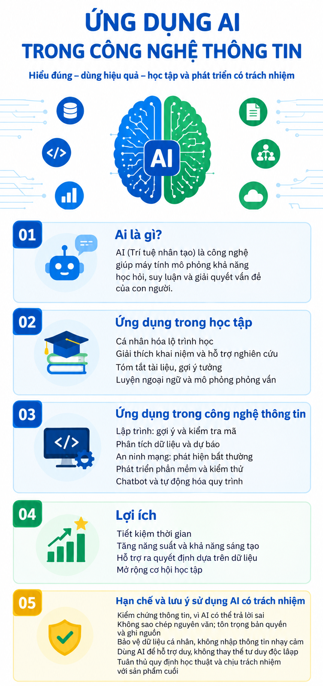

# Infographic: Ứng dụng AI trong Công nghệ Thông tin

## Mô tả tác phẩm
- **Nội dung:** Infographic tổng quan về khái niệm AI, ứng dụng trong học tập và ngành công nghệ thông tin, lợi ích cũng như các lưu ý khi sử dụng AI có trách nhiệm[cite: 1].
- **Ghi chú:** Infographic được tạo bằng Canva AI (Magic Design) và chỉnh sửa thiết kế.

---

## Giấy phép bản quyền (License)

Tác phẩm này được cung cấp theo giấy phép **Creative Commons Attribution 4.0 International (CC BY 4.0)**.

### Thông tin trích dẫn nguồn (Attribution):
* **Tác giả:** Trần Mỹ Ngọc
* **Tên tác phẩm:** Infographic Ứng dụng AI trong Công nghệ Thông tin
* **Nguồn khởi tạo:** Infographic được tạo bằng Canva AI
* **Giấy phép áp dụng:** [CC BY 4.0](https://creativecommons.org/licenses/by/4.0/deed.vi)

### Quyền lợi & Điều kiện khi sử dụng:
* **Quyền lợi:** Bất kỳ ai cũng có quyền chia sẻ, sao chép, chỉnh sửa hoặc sử dụng tác phẩm này cho mọi mục đích (kể cả thương mại).
* **Điều kiện:** Phải ghi rõ nguồn và tên tác giả gốc (**Trần Mỹ Ngọc**) cùng liên kết đến giấy phép CC BY 4.0.
